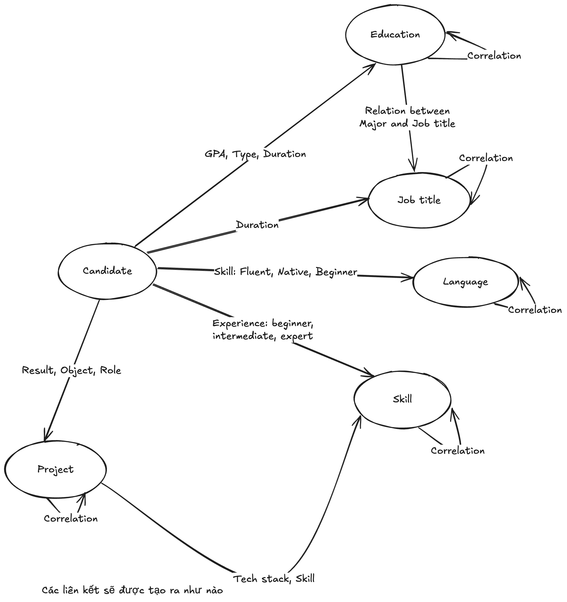

# Model

##  Introduction

Hunter's model is `Neo4j` which is a graphDB. We choose `Neo4j` because candidate information naturally form a graph structure, where entities are Candidate, Skill, Project, Job Title, Language, Project are interconnected.

## Entity and Relationship

| From | Destination | Description | Direction |
|---|---|---| --- | 
| Candidate | Education | GPA, degree, fromDate, toDate | D -> F |
| Candidate | JobTitle | fromDate, toDate | D -> F|
| Candidate | Language | Level | D -> F |
| Candidate | Skill | Level | D -> F |
| Candidate | Project | Result, Role | D -> F |  
| Education | JobTitle | Correlation between major and job title | D -> F |
| Project | Skills | Skills were used in project | D -> F |

Self-relationship: A self-relationship is used when objects have correlation with each other.

How to split edges into unweight and weight ?